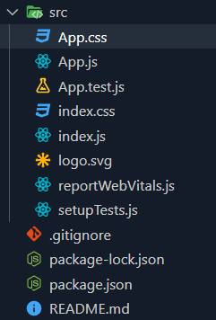
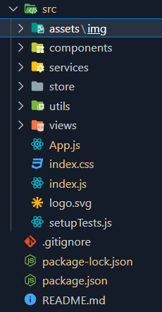

# pure-react-app

prerequisite: `npx create-react-app`

use: `npx pure-react-app`
 
>  Automatically removes unnecessary cra boilerplate content, and sets up a basic directory structure.
 

[Inspiration for directory structure](https://www.taniarascia.com/react-architecture-directory-structure/)

## The Directory Structure
Src/
  * assets - global static assets such as images, svgs, company logo, etc.
  * components - global shared/reusable components, such as layout (wrappers, navigation), form components,buttons
  * services - JavaScript modules
  * store - Global Redux store
  * utils - Utilities, helpers, constants, and the like
  * views - Can also be called "pages", the majority of the app would be contained here

  #### Removed documents: 
  Src:
  * ~~App.css~~
  * ~~reportWebVitals.js~~
  * ~~App.test.js~~
  * ~~logo.svg~~

  Public:
  * ~~favicon.ico~~
  * ~~logo192.png~~
  * ~~logo512.png~~

  #### Before with npx create-react-app

  

  #### After with npx pure-react-app
  
  